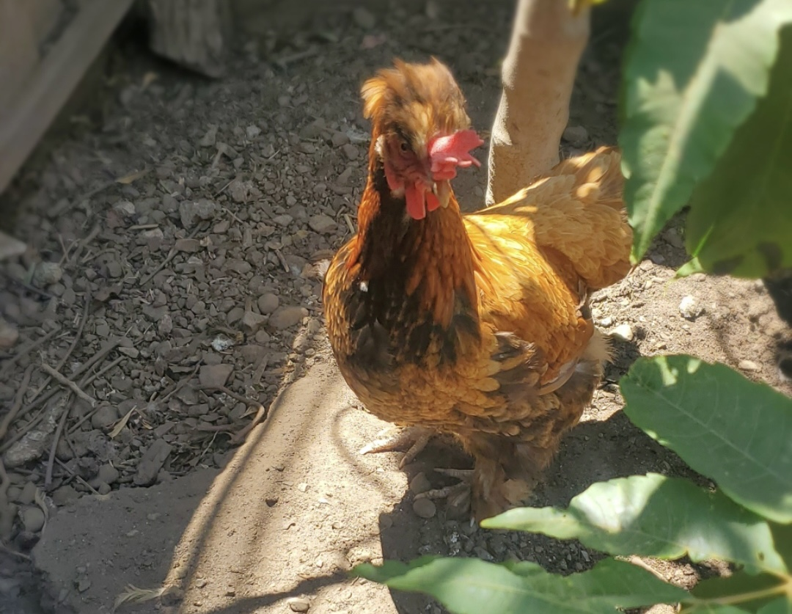

# Niklas Chang
## Computer Engineering @ UCSD
### Aspiring engineer
  
<sub>**_A picture of my Mrs. Frizzle, one of my chickens!_**</sub>

> "All problems in computer science can be solved by another level of indirection" -David Wheeler

```
std::queue<T>'s
```

All the racket sports that I play:  
* Tennis
* Table Tennis
* Badmintion

Coolest Languages:
1. Python
2. C++
3. C

Current Tasks:
- [ ] Graduate
- [ ] Get a job

Here is a link to this [repository](https://github.com/Niklichang/CSE110)

And the [README file](README.md)

Go to [top of page](#niklas-chang)

